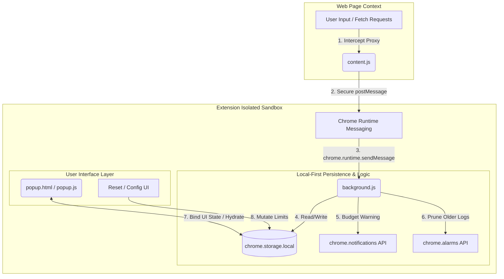

# System Architecture & Technical Specifications

**Project:** MyTokenCost Tracker (Chrome/Edge Extension)  
**Spec Version:** 1.0.0 (Manifest V3 Compliance)  
**Author:** Dharmendra Giri  
**Last Updated:** May 27, 2026

---

## 1. System Architecture Overview

MyTokenCost Tracker is designed as an isolated, client-side, zero-latency monitoring framework. To comply with modern security standards (Manifest V3), the system distributes its workloads across three isolated execution layers using secure message-passing interfaces.



---

## 2. Process Layer Disambiguation

Each script component lives in a distinct environment with different access privileges, lifetimes, and boundaries:

| Component | Lifecycle | Security & DOM Access | Core Responsibility |
| :--- | :--- | :--- | :--- |
| **`content.js`** *(Content Script)* | Tied to the tab lifecycle of matched LLM domain patterns. | Accesses Page DOM; strictly isolated from raw Page JS variables unless injected. | Observes outbound payloads, parses response telemetry, and signals background tasks. |
| **`background.js`** *(Service Worker)* | Ephemeral. Spins up on message events, notifications, or alarms, and suspends after ~5 minutes of idle time. | No DOM Access; full access to Chrome Extension APIs (`storage`, `notifications`, `alarms`). | Houses pricing metadata matrices, executes compliance math, manages log rotation, and triggers warnings. |
| **`popup.js / html`** *(Extension Popup)* | On-demand UI. Initialized when the toolbar action icon is clicked; destroyed immediately upon closing. | Scoped specifically to `popup.html`. Full Chrome API permissions; no direct host page DOM access. | Renders high-density financial metrics, manages budget configs, and handles client resets. |

---

## 3. Communication Contract (API Schema)

Components communicate across boundaries using structured JSON message payloads.

### Event: `LOG_LLM_REQUEST`
Sent from `content.js` to `background.js` upon successful interception and local token calculation of an LLM call.

* **Type:** `chrome.runtime.sendMessage`
* **Schema:**
```json
{
  "type": "LOG_LLM_REQUEST",
  "payload": {
    "provider": "openai" | "anthropic" | "google",
    "model": "gpt-4o" | "claude-3-5-sonnet" | "gemini-1.5-pro",
    "promptTokens": 1024,
    "completionTokens": 512
  }
}
```

---

## 4. Local Database Schema & Persistence Strategy

All persistent data uses `chrome.storage.local` to remain completely offline and private.

### Active Storage Keys
```json
{
  "sessionCost": 0.0234,              // Accumulated rolling 7-day spend in USD (Float)
  "tokenCount": 1523400,               // Accumulated rolling 7-day token total (Integer)
  "activeModel": "openai/gpt-4o",      // Last observed provider/model key (String)
  "budgetCeiling": 10.00,             // Daily expenditure limit alert threshold (Float)
  "enabledProviders": {                // Active monitoring configurations (Boolean Flags)
    "openai": true,
    "anthropic": true,
    "google": true
  },
  "historyLog": [                      // Rolling 7-day transaction ledger (Array of Objects)
    {
      "timestamp": 1779954000000,
      "cost": 0.0025,
      "tokenCount": 500,
      "model": "openai/gpt-4o"
    }
  ]
}
```

---

## 5. Non-Functional Specifications & Design Limits

1. **Latency Minimization:** The network intercept hooks (`content.js`) utilize asynchronous clones (`response.clone().text()`) when processing HTTP streams. This guarantees that token tracking does not block or slow down the raw API connection speed of the target application.
2. **Memory Footprint:** The background Service Worker does not maintain an active persistent state in memory. It is entirely driven by event states, saving resources for the client machine.
3. **Data Residency:** No remote analytics, web logging, or metrics aggregation libraries are included in the package. Privacy compliance is guaranteed through total isolation.
